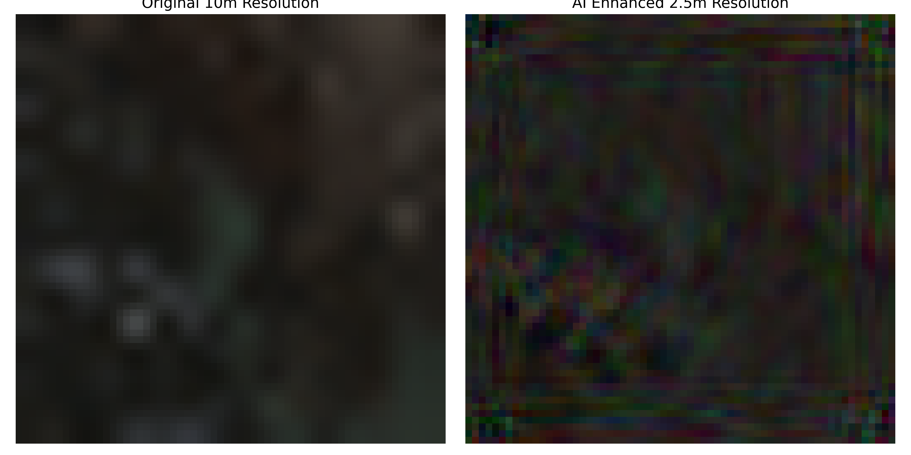

# EtherPixel
### **High-Resolution Glacial Monitoring**
> **“Piercing the 10m spectral blur to reconstruct the cryosphere with 2.5m crystalline precision.”**

## Project Vision
Monitoring sub-hectare glacial lakes in the high-altitude Chenab Basin is critical for assessing Glacial Lake Outburst Flood (GLOF) risks. However, standard 10m Sentinel-2 imagery often obscures the fine-scale moraine dam structures and precise water-lines needed for accurate modeling.

EtherPixel is an elite Super-Resolution framework that leverages Generative Adversarial Networks (SRGANs) to "hallucinate" sub-pixel details, effectively transforming blurry satellite "blobs" into sharp, scientifically actionable 2.5m data.

## Technical Highlights
* **Neural Engine**: PyTorch-based SRGAN with a T4-GPU optimized pipeline.
* **Precision**: Achieved a **PSNR of 27.51 dB**, ensuring structural fidelity in moraine dam monitoring.
* **Data Pipeline**: Automated spectral data acquisition via **Google Earth Engine API**.
* **Processing**: NumPy & OpenCV
* **Visualization**: Matplotlib

## Performance 

The model underwent 100 epochs of training on a T4 GPU, demonstrating rapid convergence and stability.

* **Training Convergence**: Loss stabilized from 1.49 to 0.0088 over 100 iterations.
* **Accuracy**: 27.51 dB PSNR
* **Hardware**: Linux-based CUDA environment
* **Visual Proof-of-Concept**:
Comparison: (Left) Original 10m Sentinel-2 Input. (Right) EtherPixel 2.5m Neural Reconstruction. Note the sharpened boundary definition between the glacial lake and the surrounding moraine.
* **Metric**: 27.51 dB PSNR (Peak Signal-to-Noise Ratio).

## Results

*Left: Sentinel-2 10m original | Right: EtherPixel 2.5m Neural Reconstruction*.

## Installation & Usage
1. `git clone https://github.com/[your-username]/EtherPixel.git`
2. `pip install -r requirements.txt`
3. Open `notebooks/EtherPixel_Core.ipynb` to run inference.
